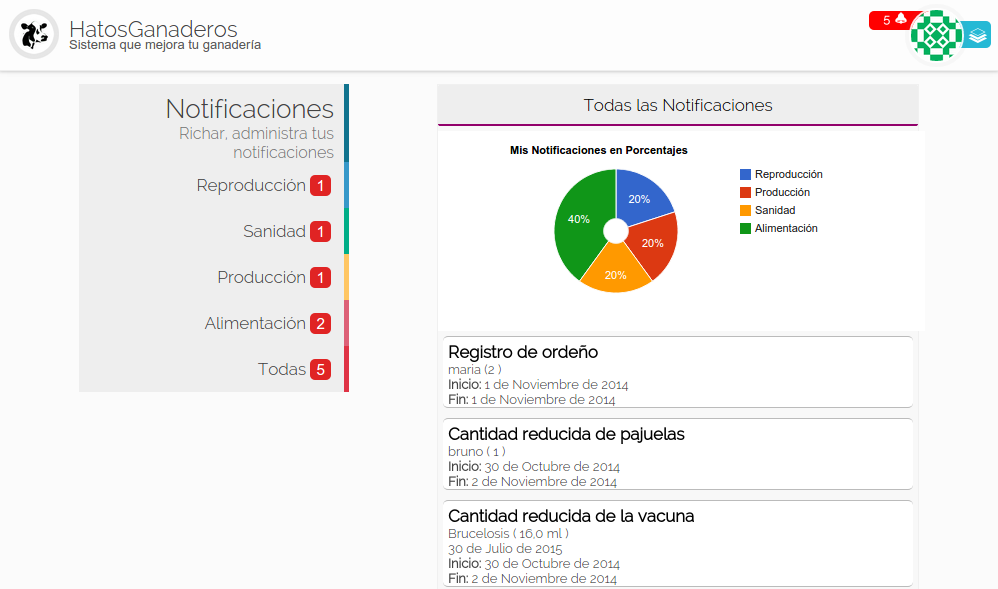
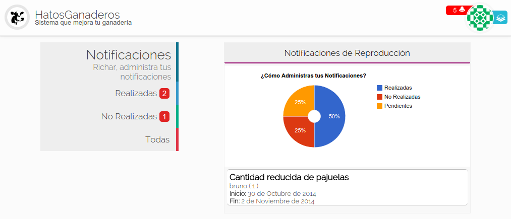
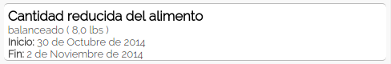

.. HatosGanaderos documentation master file, created by
   sphinx-quickstart on Sun Oct  5 19:31:55 2014.
   You can adapt this file completely to your liking, but it should at least
   contain the root `toctree` directive.

Tutorial 10: Notificaciones
===========================

HatosGanaderos provee un sistema de notificaciones que te permitirá conocer que tareas se deben realizar en la entidad ganadera. Tareas que se producen de los módulos de:

	- Reproducción
	- Producción
	- Alimentación
	- Sanidad

.. note::
	Cada notificación posee:

		- Nombre descriptivo del problema
		- Nombre, varía según la notificación (ganado, alimento, desparasitador, vacuna o registro de esperma)
		- cantidad de producto o su RP
		- Fecha inicial, en que se produjo la notificación
		- Fecha limite para atender la notificación

.. _todas_notificaciones:

Todas las Notificaciones
------------------------

Este proceso muestra todas las notificaciones de la entidad ganadera. Para realizar el proceso se sigue los siguientes pasos:

Paso 1:
	(Dirigirse a las notificaciones)

	La **figura 2.91.** muestra una captura de pantalla donde se puede observar una página que contiene en la parte superior derecha junto a la imagen seleccionada por el usuario una cinta de color rojo que indica el número de notificaciones existentes para su entidad ganadera.

	.. note::
		Si la cinta es presionada se mostrará un gráfico de la cantidad y porcentaje de notificaciones por módulo, además de contar con el listado de cada una de aquellas notificaciones que esten *pendientes* aún.

    Total de notificaciones en HatosGanaderos

Notificaciones por módulo
-------------------------

Este proceso muestra todas las notificaciones de la entidad ganadera divididas en módulos. Se deberá seguir los siguientes pasos:

Paso 1:
	(Dirigirse a las notificaciones)

	Para dirigirse a las notificaciones seguir las siguientes instrucciones :ref:`Notificaciones <todas_notificaciones>`. Luego se deberá presionar el módulo al que desee acceder en el menu de la parte izqueirda.

Paso 2:
	(Revisar las notificaciones del módulo seleccionado)

	La **figura 2.92.** muestra una captura de pantalla donde se puede observar una página con todas las notificaciones pendientes del módulo elegido, un gráfico que indica las cantidades y porcentajes de:

		- Notificaciones realizadas
		- Notificaciones no realizadas
		- Notificaciones pendientes

	Y un menu en la parte izquierda que permitirá filtrar las notificaciones por:

		- Notificaciones realizadas
		- Notificaciones no realizadas
		- Notificaciones pendientes

	.. note::
		Al presionar las notificaciones de: Pendientes o No realizadas, se les cambiara el estado a realizadas.

    Notificaciones por módulo en HatosGanaderos

Confirmar Notificación
----------------------

Este proceso se encarga de dar por realizada una notificación dentro de nuestra entidad ganadera.

Paso 1:
	(Realizar una notificación)

	La **figura 2.93.** muestra una captura de pantalla donde se puede observar una notificación la cual al ser presionada cambiará de estado 'Pendiente' a 'Realizada'. 

	Caso contrario si no se deseao no se ha llevado a cabo la acción mencionada en la notificación no se deberá hacer absolutamente nada con ella, ya que automáticamente cumplida la fecha de vencimiento de la notificación pasará al estado 'No realizada'.

	Realizado esto el proceso finaliza correctamente.

    Dar por realizada una notificación en HatosGanaderos