.. HatosGanaderos documentation master file, created by
   sphinx-quickstart on Sun Oct  5 19:31:55 2014.
   You can adapt this file completely to your liking, but it should at least
   contain the root `toctree` directive.

Tutorial 1: Cuentas
=========================

Para el correcto funcionamiento de HatosGanaderos se brinda la posibilidad de crear cuentas en el sitio web, lo cuál da la posibilidad de poder configurar nuestra entidad ganadera. 

Registro
--------

Para realizar el registro de una cuenta en *HatosGanaderos* se deben realizar los siguientes pasos:

Paso 1:
	(Dirigirse a la página home de HatosGanaderos)
	
	La **figura 2.1.** muestra una captura de pantalla donde se puede observar la página de inicio denominada *home,* contiene datos informativos sobre el sitio web *HatosGanaderos*, además de contener dos botones:

		- Registrar
		- Ingresar

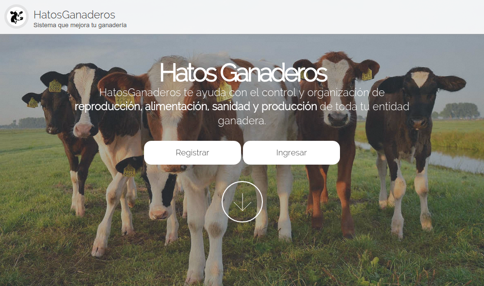

    Página home de HatosGanaderos

.. _paso2_cuentas:

Paso 2:
	(Presionar el botón Registrar)
	
	La **figura 2.2** muestra una captura de pantalla donde se puede observar un formulario para el registro en *HatosGanaderos,* Se solicitan datos como:

		- Nombre de usuario
		- Correo Electrónico
		- Contraseña
		- Verificación de contraseña

	Los cuáles son necesarios para la correcta creación de la cuenta.

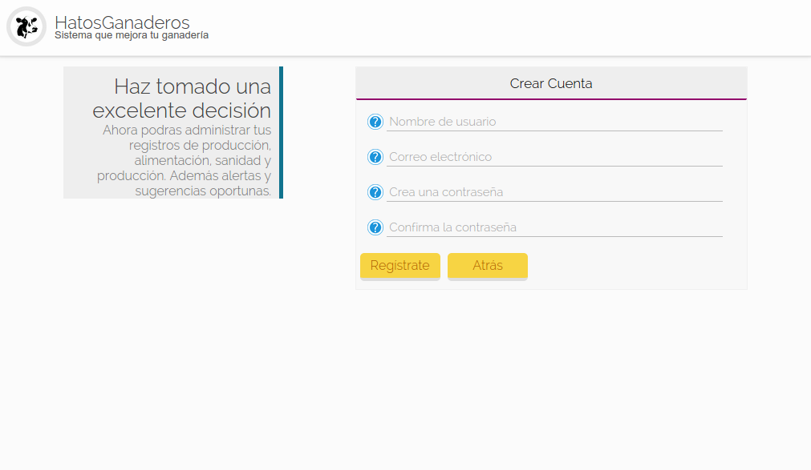

    Registrar cuenta en HatosGanaderos

Paso 3:
	(Presionar el boton Registrate)

	Si los datos ingresados son correctos, se enviará un correo electrónico a la cuenta especificada en el :ref:`Paso 2 <paso2_cuentas>` el cuál contiene un código de activación.

Paso 4:
	(Activar Cuenta)

	La **figura 2.3.** muestra una captura de pantalla donde se puede observar un link. Deberá hacer clic sobre él para que redireccione a su perfil correctamente creado en *HatosGanaderos.*

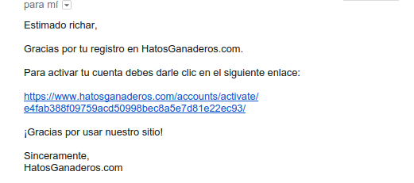

    Activar cuenta de HatosGanaderos

Recuperar Contraseña
--------------------

En el caso que olvide la contraseña de su cuenta de *HatosGanaderos* la puede recuperar siguiendo los siguientes pasos:

Paso 1:
	(Dirigirse a la página de ingreso al sistema)

	La **figura 2.4.** muestra una captura de pantalla donde se puede observar un link *¿Olvidaste tu contraseña?* el cuál tiene que ser clickeado para poder redireccionar a un formulario que le ayudará en el proceso.

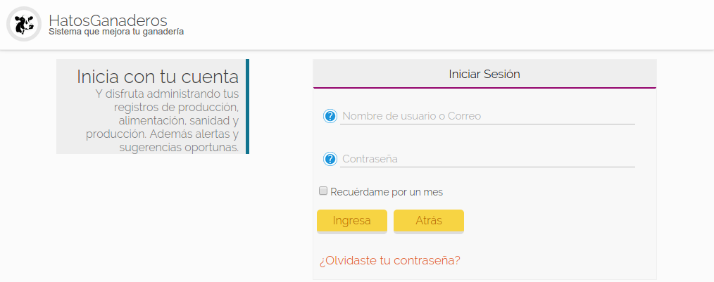

    Recuperar contraseña de cuenta de HatosGanaderos

Paso 2:
	(Ingresar su correo electrónico)

	La **figura 2.5.** muestra una captura de pantalla donde se puede observar un formulario que le solita:

		- Correo electrónico de su cuenta

	Deberá ingresar su correo electrónico y presionar el boton *Enviar Contraseña* para continuar con el proceso.

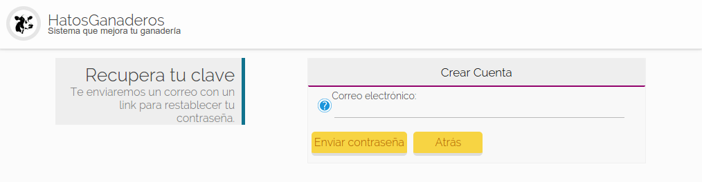

    Ingresar correo de cuenta de HatosGanaderos

Paso 3:
	(Verificar correo)

	La **figura 2.6.** muestra una captura de pantalla donde se puede observar el correo que fue enviado en el paso anterior:

	Deberá presionar el link para continuar con el proceso.

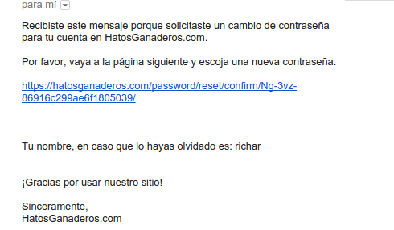

    Verificar correo de recuperación de contraseña en HatosGanaderos

Paso 4:
	(Reinicializar contraseña)

	La **figura 2.7.** muestra una captura de pantalla donde se puede observar el formulario al que fue rediregido en el paso anterior:

	Deberá ingresar los datos que se le solicitan:

		- Contraseña nueva
		- Confirmación de contraseña nueva

	Luego deberá dar clic en el boton *Reinicializar tu contraseña* y el proceso habrá finalizado con éxito. ya puede ingresar a su cuenta en *HatosGanaderos.*

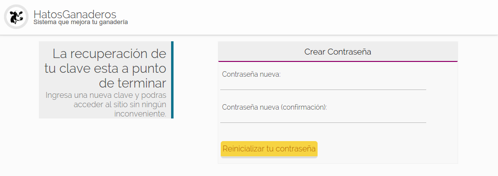

    Reinicializar contraseña en HatosGanaderos

.. _login:

Login
-----

El proceso de login es necesario para poder administrar su entidad ganadera, se seguirá los siguientes pasos:

Paso 1:
	(Dirigirse a la página de login)

	La **figura 2.8.** muestra una captura de pantalla donde se puede observar la página de login, que solicita el ingreso de:

		- Nombre de usuario o Correo electrónico
		- Contraseña

	Luego de ingresar correctamente los datos se presiona el boton *Ingresar* El cuál redireccionará exitosamente a su perfil en *HatosGanaderos.*

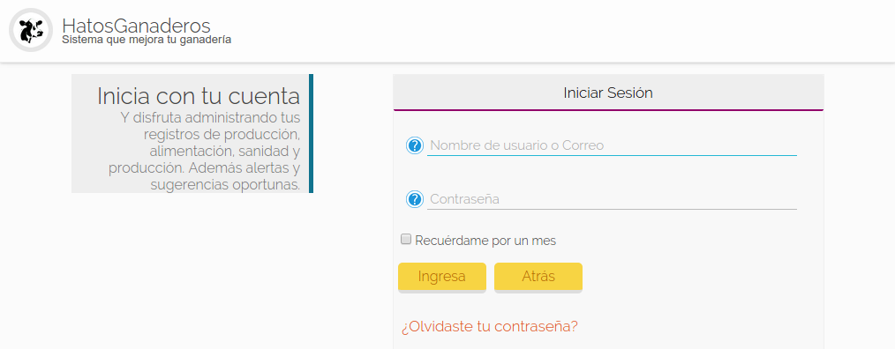

    Login en HatosGanaderos

Modificar Detalles de Cuenta
----------------------------

El proceso de modificar detalles de su cuenta en *HatosGanaderos* se lo debe realizar al inicio obligatoriamente y luego ya es opcional. Se seguirá los siguientes pasos:

.. _paso1_modificar_detalles_cuenta:

Paso 1:
	(Dirigirse al perfil en HatosGanaderos)

	Luego de haberse logueado en el sistema :ref:`¿Cómo me logueo? <login>`.

	La **figura 2.9.** muestra una captura de pantalla donde se puede observar el perfil creado en *HatosGanaderos*.

	.. note::
		El sistema a través de su correo electrónico intentará conectar a `Gravatar <http://gravatar.com>`_ y revisar si posee una imagen registrada y si no es el caso agregará una imagen aleatoria a su cuenta en HatosGanaderos. 
   
    Para modificar datos se presiona la opción de *Modificar los detalles* en el menú de la izquierda.

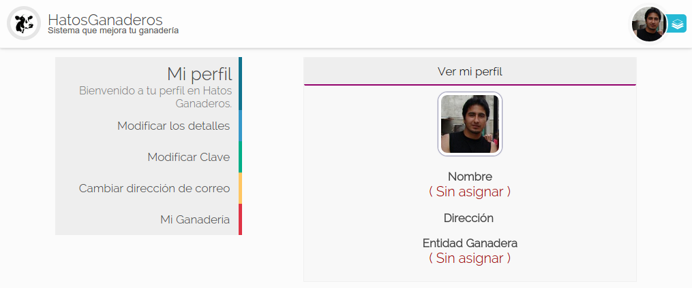

    Perfil en HatosGanaderos

Paso 2:
	(Modificar detalles del perfil)

	La **figura 2.10.** muestra una captura de pantalla donde se puede observar el formulario para modificar los detalles del perfil registrado en *HatosGanaderos.*

	Los datos que se pueden modificar son:

		- Nombre
		- Apellido
		- Retrato
		- Sexo
		- Dirección
		- Teléfono

	Luego de agregar está información en el formulario se presiona el boton *Grabar* para persistir la información.

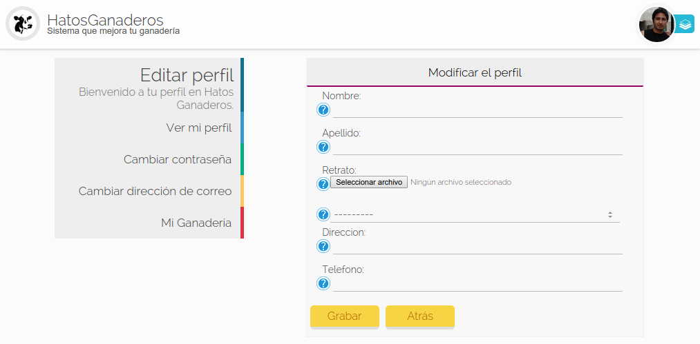

    Modificar detalles del perfil en HatosGanaderos

Modificar Clave
---------------

Para realizar el proceso de modificación de clave de la cuenta registrada en *HatosGanaderos* se seguirá los siguientes pasos:

Paso 1:
	(Ingresar nueva clave)

	Dirigirse al perfil registrado en *HatosGanaderos* :ref:`Perfil en HatosGanaderos. <paso1_modificar_detalles_cuenta>`

	La **figura 2.11.** muestra una captura de pantalla donde se puede observar que se solicita el ingreso de algunos datos:

		- Contraseña antigua
		- Contraseña nueva
		- Confirmación de la contraseña nueva

	Se solicita la clave antigua para poder validar la autenticidad del usuario, posterior a ello una nueva contraseña con su respectiva confirmación. Para continuar se presiona el botón *Cambiar contraseña* y se finalizará exitosamente el proceso.

.. figure:: _static/img/cambiar_clave.png
    :width: 100%

    Cambiar clave en HatosGanaderos

Cambiar Correo Electrónico
--------------------------

Para realizar el proceso de cambiar el correo electrónico vinculado a la cuenta registrada en *HatosGanaderos* se seguirá los siguientes pasos:

Paso 1:
	(Ingresar nuevo correo)

	Dirigirse al perfil registrado en *HatosGanaderos* :ref:`Perfil en HatosGanaderos. <paso1_modificar_detalles_cuenta>`

	La **figura 2.12.** muestra una captura de pantalla donde se puede observar que se solicita el ingreso del:

		- Nuevo correo electrónico

	Luego de ingresar el requisito correctamente se procede a presionar el botón *Cambiar dirección de correo* y el proceso finalizará exitosamente.

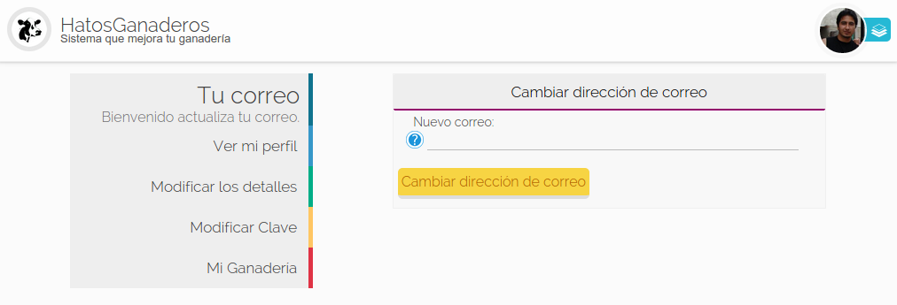

    Cambiar correo electrónico en HatosGanaderos
