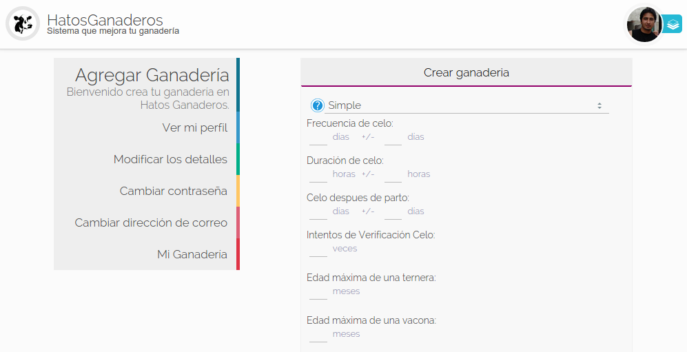
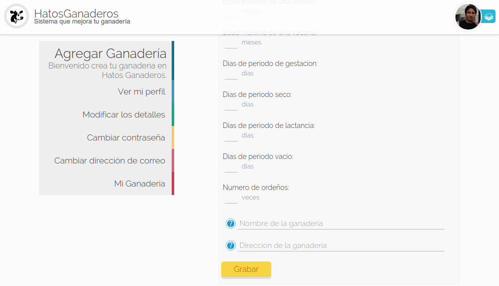

.. HatosGanaderos documentation master file, created by
   sphinx-quickstart on Sun Oct  5 19:31:55 2014.
   You can adapt this file completely to your liking, but it should at least
   contain the root `toctree` directive.

Tutorial 2: Configuración
=========================

HatosGanaderos es un sistema web que te permite configurar los datos necesarios para el control y administración de la entidad ganadera.

Crear Configuración de la Ganadería
-----------------------------------

Para registrar los datos particulares de cada entidad ganadera se seguirá los siguientes pasos:

.. note::
	*HatosGanaderos* exige que se configure la entidad ganadera antes de cualquier otro proceso.

Paso 1:
	(Ingresar datos de la entidad ganadera)

	Dirigirse al perfil registrado en *HatosGanaderos* :ref:`Perfil en HatosGanaderos. <paso1_modificar_detalles_cuenta>`

	La **figura 2.13.** y la **figura 2.14.** muestran las capturas de pantalla donde se puede observar que se solicita que se ingrese los siguientes datos:

		- Tipo de indentificación

			El sistema presenta dos opciones de identificación del ganado:

				#. Norma Ecuador

					Posee los siguientes atributos:

						- Siglas del País
						- Código del País
						- Código de Provincia
						- Número de serie
						- Código de barras
						- RP
						- Nombre
						- RP de la madre
						- RP del padre

				#. Simple

					Posee los siguientes atributos:

						- RP
						- Nombre
						- RP de la madre
						- RP del padre

		- Frecuencia del celo

			Cada cuantos días se presenta el celo en el ganado (21 días) con su respectivo margen de error.

		- Duración del celo

			El celo normalmente tiene una duración en horas (20 horas) adicional se solicita el margen de error.

		- Celo después del parto

			Cuántos días se contemplan de descanso luego del parto para que entre en celo un ganado con su respectivo margen de error.

		- Intentos de verificación del celo

			Número de intentos que se puede tratar de verificar el servicio correcto.

		- Edad máxima de una ternera

			El número de meses máximo que puede tener un ganado para que sea considerada ternera.

		- Edad máxima de una vacona

			El número de meses máximo que puede tener un ganado para que sea considerada vacona.

			.. note::
				*HatosGanaderos* contempla 5 etapas del ganado:

					- Ternera
					- Vacona media
				        - Vacona fierro
				        - Vacona vientre
					- Vaca

		- Días de período de gestación

			Días que el ganado va estar en el período o ciclo de gestación (281 días).

		- Días de período seco

			Días que el ganado va estar en el período o ciclo seco (60 días).

		- Días de período de lactancia

			Días que el ganado va estar en el período o ciclo de lactancia (300 días).

		- Días de período vacío

			Días que el ganado va estar en el período o ciclo vacío (90 días).

		- Número de ordeños

			El número de ordeños diarios para el registro de producción.

		- Nombre de la Ganadería

			El nombre de la entidad ganadera.

		- Dirección de la ganadería

			Dirección de la entidad ganadera.

	Una vez ingresada la información correcta a la configuración de la ganadería, en la **figura 2.14.** se muestra una captura de pantalla donde se puede observar un botón *Grabar* que se debe presionar para persistir la información proporcionada.

	Y con esto se guardo correctamente la nueva configuración de la entidad ganadera.

    Configurar ganadería

    Configurar ganadería

