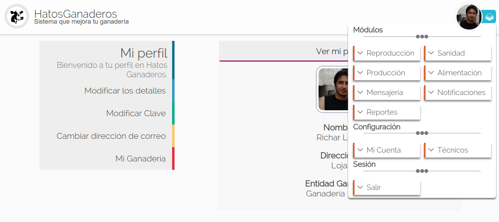
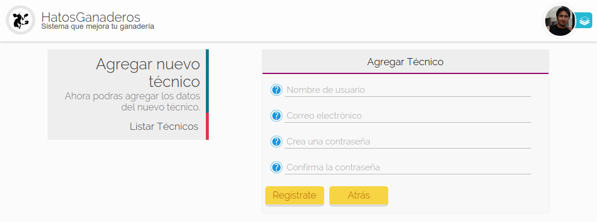
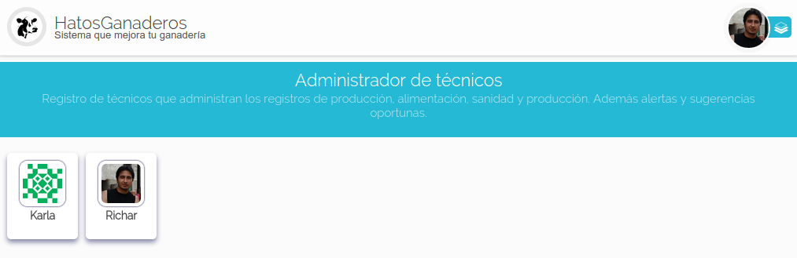

.. HatosGanaderos documentation master file, created by
   sphinx-quickstart on Sun Oct  5 19:31:55 2014.
   You can adapt this file completely to your liking, but it should at least
   contain the root `toctree` directive.

Tutorial 3: Técnicos
====================

HatosGanaderos te permite el registro de varios técnicos dentro de la entida ganadera con el objetivo de administrar y organizar la ganadería.

Crear Cuentas de Técnicos
-------------------------

Para registrar técnicos se lo realizará desde la cuenta administradora (aquella que contiene la configuración de la ganadería). Y se seguirá los siguientes pasos:

.. _menu_hatosganaderos:

Paso 1:
	(navegar por el menu)

	La **figura 2.15.** muestra una captura de pantalla donde se puede observar el menu en la parte superior derecha que permite dirigirse a los diferentes módulos, la configuración y el cierre de sesión.

    Menu de HatosGanaderos

.. _paso2_tecnicos:

Paso 2:
	(Registrar técnico)

	Presionar el botón *Técnicos* del :ref:`menu de HatosGanaderos <menu_hatosganaderos>`.

	La **figura 2.16.** muestra una captura de pantalla donde se puede observar el formulario de registro de técnicos en *HatosGanaderos,* que solicita los datos siguientes:

		- Nombre de usuario
		- Correo electrónico
		- Contraseña
		- Confirmación de contraseña

	Luego de haber ingresado los datos correctamente se presiona el botón *Registrate*.

    Registro de técnicos en HatosGanaderos

Paso 3:
	(Validar registro)

	Realizados los pasos anteriores el sistema *HatosGanaderos* enviará un correo al email registrado en la cuenta del nuevo técnico, el correo contiene un link que lo llevará a su perfil en *HatosGanaderos* y el proceso habrá finalizado con éxito.

Listar Cuentas de Técnicos
--------------------------

El proceso de listar cuentas de técnicos de su entidad ganadera se obtiene siguiendo los pasos descritos a continuación:

Paso 1:
	(Listar técnicos)

	Se presiona el botón *Listar Técnicos* del :ref:`menu de Agregar Técnico <paso2_tecnicos>`.

	La **figura 2.17.** muestra una captura de pantalla donde se puede observar el listado de técnicos exxistenetes en la entidad ganadera.

	.. note::
		La cuenta del administrador, aquel que posee la configuración de la cuenta también es considerado técnico.

    Lista de técnicos en HatosGanaderos

