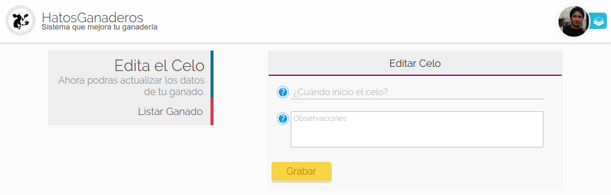
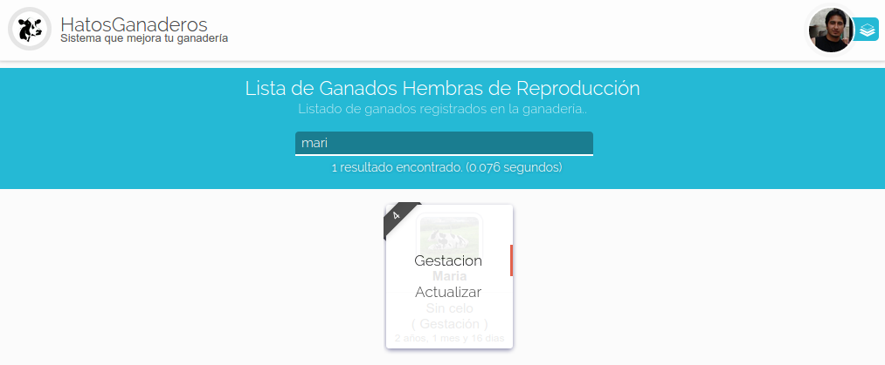

.. HatosGanaderos documentation master file, created by
   sphinx-quickstart on Sun Oct  5 19:31:55 2014.
   You can adapt this file completely to your liking, but it should at least
   contain the root `toctree` directive.

Tutorial 4: Módulo de Reproducción
==================================

HatosGanaderos agrega un módulo de reproducción con el cuál podrás registrar ganados, editarlos, registrar celos, registrar partos, posibles problemas en la gestación.  

Registrar Ganados
-----------------

Para realizar el registro de ganados en *HatosGanaderos* se debe seguir los siguientes pasos:

Paso 1:
	(Ingresar datos del ganado)

	Dirigirse al :ref:`menu de HatosGanaderos <menu_hatosganaderos>` y en la sección de *Módulos* presionar el botón de *Reproducción.*

	La **figura 2.18.** y la **figura 2.19.** muestran unas capturas de pantalla donde se puede observar el formulario para poder registrar el ganado. Los datos que se requieren son:

		.. note::
			Para el ejemplo se utilizo el tipo de identificación simple.

		- Forma que se concibio (Inseminación o Monta)
		- Nombre
		- RP de la madre
		- RP del padre
		- Imagen
		- Fecha de nacimiento
		- Sexo
		- Raza
		- Peso vivo
		- Observaciones

    Registro de ganado en HatosGanaderos

    Registro de ganado en HatosGanaderos

    Luego de haber ingresado los datos solicitados correctamente, se presiona el botón *Grabar* y el proceso finaliza exitosametne.

Listar ganados
--------------

El proceso que te ayuda a saber cuáles son los animales de tu entidad ganadera es *Listar ganados* y permite listar los ganados machos y hembras por separado por mayor facilidad y organización. Se debe seguir los siguientes pasos:

.. _lista_ganado:

Paso 1:
	(Listar ganados)

	La **figura 2.18.** muestra una captura de pantalla donde se puede observar un menu en la parte izquierda y tenemos dos opciones *Listar Hembras y Listar Machos* se debe presionar la que deseemos.

	La **figura 2.20.** y la **figura 2.21.** muestran unas capturas de pantalla donde se puede observar el listado de ganados (hembras y machos por separado) de la entidad ganadera.

    Listar ganados hembras en HatosGanaderos

    Listar ganados machos en HatosGanaderos

Actualizar Datos del Ganado
---------------------------

Si se requiere actualizar ciertos datos del ganado registrado en *HatosGanaderos* se deberá realizar los siguientes pasos:

.. _seleccionar_ganado:

Paso 1:
	(Selección del ganado)

	Se debe listar el ganado :ref:`Listar Ganados, <lista_ganado>`.

	La **figura 2.22.** muestra una captura de pantalla donde se puede observar la búsqueda del ganado del cuál se desea actualizar su información.

	.. note::
		Para hacer la búsqueda del ganado más eficiente *HatosGanaderos* brinda la posibilidad de hacer uso de una barra de búsqueda ubicada en la parte superior. Está búsqueda se la puede realizar por los siguientes criterios:

			- RP
			- Nombre
			- Año de nacimiento

    Búsqueda de ganados en HatosGanaderos

.. _menu_ganado:

Paso 2:
	(Seleccionar actualizar datos del ganado)

	La **figura 2.23.** muestra una captura de pantalla donde se puede observar que si se ubica el cursor sobre el ganado buscado se muestra un menu contextual que brinda las opciones:

		- Celo
		- Actualizar

	Para continuar debemos presionar la opción de *Actualizar.*

    Seleccionar actualizar datos de ganado en HatosGanaderos	

Paso 3:
	(Actualziar datos del ganado)

	La **figura 2.24.** muestra una captura de pantalla donde se puede observar un formulario que nos permite actualizar la información del ganado registrado en *HatosGanaderos.*

	Finalmente se presiona el botón *Grabar* y el proceso finalizará correctamente.

    Actualizar datos de ganado en HatosGanaderos

Agregar Celo
------------

El proceso de agregar celo a un ganado se debe seguir los siguientes pasos:

Paso 1:
	(Seleccionar ganado y agregar celo)

	Se debe buscar y seleccionar el ganado :ref:`Selección del ganado <seleccionar_ganado>` y seleccionar la opción de *Celo* en el menu del ganado :ref:`Seleccionar celo del ganado <menu_ganado>`.

Paso 2:
	(Ingresar datos del celo)

	La **figura 2.25.** muestra una captura de pantalla donde se puede observar un formulario para el registro del celo, se solicita ciertos datos:

		- Fecha de inicio del celo
		- Observaciones

	Una vez ingresados los datos correctos el ganado entrará a estar en celo.

    Registar celo de ganado en HatosGanaderos

.. _registro_servicio:

Agregar Inseminación o Monta
----------------------------

El proceso de agregar insiminación o monta a un ganado se lo debe realizar siguiendo los siguientes pasos:

Paso 1:
	(Seleccionar ganado)

	Se debe buscar y seleccionar el ganado que este en *celo* :ref:`Selección del ganado <seleccionar_ganado>`.

.. _seleccionar_servicio:

Paso 2:
	(Seleccionar Servicio en el menu)

	La **figura 2.26.** muestra una captura de pantalla donde se puede observar que si se ubica el cursor sobre el ganado seleccionado en el paso anterior se mostrará un menu contextual con las opciones:

		- Celo
		- Servicio
		- Actualizar

	Para continuar se debe presionar la opción *Servicio*.

.. figure:: _static/img/selecciona_servicio.png
    :width: 100%

    Seleccionar servicio del menu en HatosGanaderos

Paso 3:
	(Ingresar datos del servicio)

	La **figura 2.27.** muestra una captura de pantalla donde se puede observar	un formulario que solicita datos:

		- Tipo de concepción (Inseminación o Monta)
		- RP del padre
		- Observaciones

	Luego de ingresar los datos correctos se presiona el botón *Grabar* y el proceso habrá finalizado correctamente.

    Agregar el servicio a un ganado en HatosGanaderos

Verificación de Celo
--------------------

El proceso de verificación de celo consiste en verificar la inseminacion o monta correcta realizada al ganado, para poder realizarla exitosamente se seguirá los siguientes pasos:

Paso 1:
	(Seleccionar ganado y seleccionar opcion de servicio)

	Se seguirá los siguientes pasos :ref:`Selección del ganado <seleccionar_ganado>` y :ref:`Seleccionar servicio del menu <seleccionar_servicio>`.

	La **figura 2.28.** muestra una captura de pantalla donde se puede observar	el resultado de seguir los pasos anteriores. 

	.. note::
		El número de notificaciones que se le presenten depende de la cantidad de las mismas especificadas al momento de configurar la ganadería. 

	Para este ejemplo se cuenta con 3 intentos de verificación del servicio, en cada una de las fichas se encuentra:

		- Nombre
		- Fecha deĺ servicio
		- Fecha de verificación

    Verificacion del servicio en HatosGanaderos

paso 2:
	(Seleccionar verficar en ficha)

	La **figura 2.29.** muestra una captura de pantalla donde se puede observar si se ubica el cursor sobre la ficha de verificación se muestra una opción *Verificar*.

	Se debe presionar para continuar con el proceso.

    menu de ficha de verificacion del servicio en HatosGanaderos

Paso 3:
	(Ingresar datos de verificación)

	La **figura 2.30.** muestra una captura de pantalla donde se puede observar un formulario que solicita el ingreso de:

		- El estado del servicio (correcto o incorrecto)
		- Observaciones

	Ya posee datos precargados que son:

		- Tipo de concepción
		- RP del padre

	Que son datos que fueron agregados en el momento de :ref:`Registro de servicio <registro_servicio>`.

	Se ingresan los datos y se presiona el botón *Grabar* para finalizar correctamente.

    Verificacion del servicio en HatosGanaderos

Agregar Problemas de Gestación
------------------------------

En el proceso de gestación se pueden presentar algunos inconvenientes y hay que registrarlos, para ello se sigue los siguientes pasos:

.. _paso1_problema_gestacion:

Paso 1:
	(Seleccionar ganado)

	La **figura 2.31.** muestra una captura de pantalla donde se puede observar como se busco a través de la barra de búsqueda de *HatosGanaderos* el nombre del ganado *mari* y se obtuvo un resultado correcto.

    Seleccionar ganado en gestación en HatosGanaderos

.. _paso2_problema_gestacion:

Paso 2:
	(Selección de la opción gestación)

	La **figura 2.32.** muestra una captura de pantalla donde se puede observar si se ubica el cursor sobre la ficha del ganado se mostrará un menu contextual que contiene la opción:

		- Gestación
		- Actualizar

	Se debe presionar la opción *Gestación* para continuar con el proceso.

    Seleccionar opción de gestación en HatosGanaderos

Paso 3:
	(Selección de la opción Reportar Problema)

	La **figura 2.33.** muestra una captura de pantalla donde se puede observar en el menu de la izquierda la opción *Reportar Problema*.

	Se debe presionar la opción *Reportar Problema* para continuar con el proceso.

    Seleccionar opción reportar problema en HatosGanaderos

Paso 4:
	(Ingresar problema de gestación)

	La **figura 2.34.** muestra una captura de pantalla donde se puede observar un formulario que solicita el ingreso de ciertos atributos:

		- Fecha del problema
		- Tipo de problema

			- Aborto
			- Nacido muerto
			- Madre muerta
			- Los dos muertos
		-Observaciones

	Luego de ingresar los datos correctamente se debe presionar la opción *Grabar* para finalizar el proceso exitosamente.

    Registrar problema de gestación en HatosGanaderos

Agregar Gestación Correcta
--------------------------

Para registrar una gestación correcta se seguirá los siguientes pasos:

Paso 1:
	(Seleccionar ganado y seleccionar opción de gestación)

	Realizamos la búsqueda del ganado :ref:`Buscar Ganado <paso1_problema_gestacion>` y seleccionamos la opción de *Gestación* del menu contextual :ref:`Seleccionar gestación <paso2_problema_gestacion>`.

Paso 2:
	(Ingresar datos de la gestación)

	La **figura 2.35.** muestra una captura de pantalla donde se puede observar los siguientes atributos:

		- Fecha de servicio
		- Fecha del posible parto
		- Tipo de parto (Normal o cesárea)
		- Observaciones

	Luego que ya estos datos sean ingresados correctamente se presiona el botón *Grabar* y el proceso finaliza correctamente.

    Registrar gestación en HatosGanaderos

Registrar Esperma
-----------------

El proceso de registrar esperma en la entidad ganadera se lo realizará siguiendo estos sencillos pasos:

Paso 1:
	(Ingresar datos del esperma)

	Dirigirse al :ref:`menu de HatosGanaderos <menu_hatosganaderos>` y en la sección de *Módulos* presionar el botón de *Reproducción* para continuar el proceso se debe presionar la opción del menu izquierdo *Registrar Esperma*.

	La **figura 2.36.** muestra una captura de pantalla donde se puede observar el formulario para poder registrar el esperma. Los datos que se requieren son:

		- Nombre
		- Fecha de registro
		- Número de pajuelas
		- Raza 
		- Observaciones

	Luego de ingresar los datos correctos se presiona el botón *Grabar* y el proceso finaliza correctamente.

    Registro de esperma en HatosGanaderos

.. _lista_esperma:

Listar Esperma
--------------

El proceso de listar esperma registrado en la entidad ganadera se lo realizará siguiendo estos sencillos pasos:

Paso 1:
	(Listar esperma)

	Dirigirse al :ref:`menu de HatosGanaderos <menu_hatosganaderos>` y en la sección de *Módulos* presionar el botón de *Reproducción* para continuar el proceso se debe presionar la opción del menu izquierdo *Listar Esperma*.

	La **figura 2.37.** muestra una captura de pantalla donde se puede observar el listado de fichas de esperma registrados en *HatosGanaderos,* cada ficha contiene:

		- Nombre
		- Raza
		- Número de pajuelas
		- Fecha de registro 

	El proceso de listar esta concluido correctamente.

    Listar esperma en HatosGanaderos

Actualizar Datos de Esperma
---------------------------

El proceso de actualizar esperma registrado en la entidad ganadera se lo realizará siguiendo estos sencillos pasos:

Paso 1:
	(Listar y búsqueda del esperma)

	Se deberá listar el esperma :ref:`Listar Esperma <lista_esperma>`.

	La **figura 2.38.** muestra una captura de pantalla donde se puede observar la búsqueda del esperma *Brunito* para ello se hace uso de la barra de búsqueda que provee *HatosGanaderos* en la parte superior, los criterios de búsqueda son:

		- RP
		- Nombre
		- Año de registro

    Buscar esperma en HatosGanaderos

Paso 2:
	(Seleccionar la opción de actualizar)

	La **figura 2.39.** muestra una captura de pantalla donde se puede observar si se ubica el cursor sobre la ficha del esperma buscado anteriormente, se muestrará una opción *Actualizar* que deberá ser presionadapara continuar con el proceso.

    Opción actualizar esperma en HatosGanaderos

Paso 3:
	(Actualizar datos del esperma)

	La **figura 2.40.** muestra una captura de pantalla donde se puede observar un formulario con datos previamente cargados que pueden ser modificados:

		- Nombre
		- Fecha de registro
		- Número de pajuelas
		- Raza
		- Observaciones

	Luego de haber modificado con datos correctos se debe presionar el botón *Grabar* y el proceso finalizará con éxito.

    Actualizar esperma en HatosGanaderos

Dar de Baja a un Ganado
-----------------------

El proceso de dar de baja a un ganado registrado en la entidad ganadera se lo realizará siguiendo estos sencillos pasos:

Paso 1:
	(Listar y seleccionar ganado)

	Se deberá listar los ganados registrados en *HatosGanaderos* :ref:`Listar Ganados <lista_ganado>`.

	La **figura 2.41.** muestra una captura de pantalla donde se puede observar la búsqueda del ganado *bonita* para ello se hace uso de la barra de búsqueda que provee *HatosGanaderos* en la parte superior, los criterios de búsqueda son:

		- RP
		- Nombre
		- Año de registro

    Buscar y seleccionar ganado en HatosGanaderos

Paso 2:
	(Ingresar datos de baja)

	La **figura 2.42.** muestra una captura de pantalla donde se puede observar un formulario para ingresar la información de la futura baja del ganado, posee los campos como:

		- Fecha de la baja
		- Causa
		- Observaciones

	Una vez ingresada esta información se presiona el botón *Grabar* y el proceso deberá finalizar correctamente.

    Dar de baja al ganado en HatosGanaderos

Dar de Baja un Registro de Esperma
----------------------------------

El proceso de dar de baja un registro de esperma registrado en la entidad ganadera se lo realizará siguiendo estos sencillos pasos:

Paso 1:
	(Listar y seleccionar el esperma)

	Se deberá listar los registros de esperma registrados en *HatosGanaderos* :ref:`Listar esperma <lista_esperma>`.

	La **figura 2.43.** muestra una captura de pantalla donde se puede observar la búsqueda del registro de esperma *bruno* para ello se hace uso de la barra de búsqueda que provee *HatosGanaderos* en la parte superior, los criterios de búsqueda son:

		- RP
		- Nombre
		- Año de registro

    Buscar y seleccionar esperma en HatosGanaderos

Paso 2:
	(Ingresar datos de baja)

	La **figura 2.44.** muestra una captura de pantalla donde se puede observar un formulario para ingresar la información de la futura baja del registro de esperma, posee los campos como:

		- Fecha de la baja
		- Causa
		- Observaciones

	Una vez ingresada esta información se presiona el botón *Grabar* y el proceso deberá finalizar correctamente.

    Dar de baja el registro de esperma en HatosGanaderos