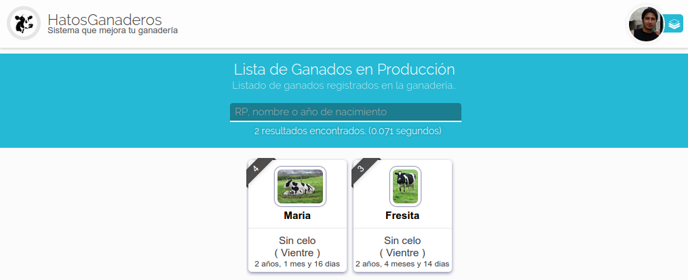
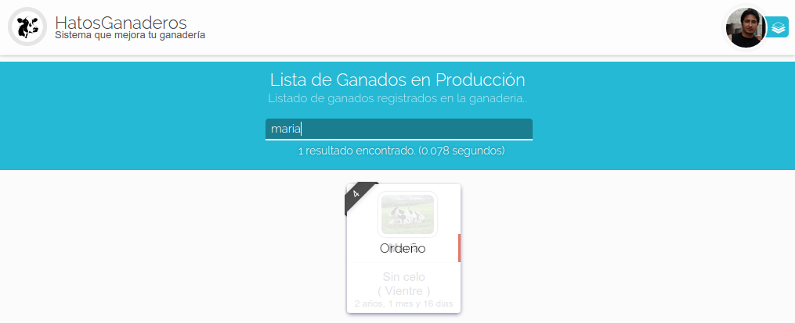
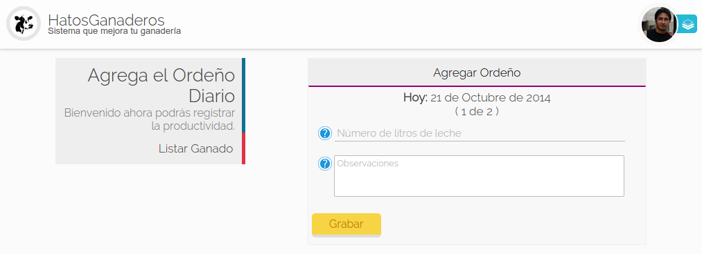
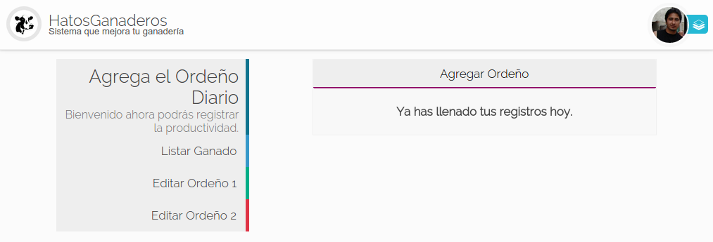
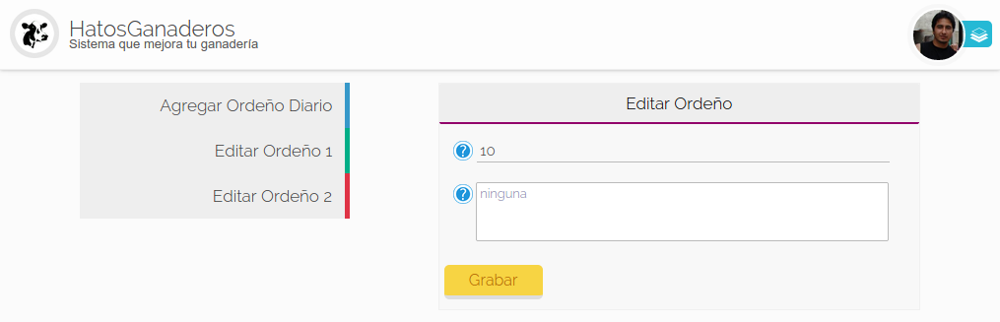

.. HatosGanaderos documentation master file, created by
   sphinx-quickstart on Sun Oct  5 19:31:55 2014.
   You can adapt this file completely to your liking, but it should at least
   contain the root `toctree` directive.

Tutorial 5: Módulo de Producción
================================

HatosGanaderos brinda la posibilidad de registrar el ordeño diario de los ganados de tu entidad ganadera,para poder mantener un registro de la producción del ganado.

.. _lista_produccion:

Listar Ganados de Producción
----------------------------

El proceso de listar ganados en producción se lo debe realizar siguiendo estos sencillos pasos:

Paso 1:
	(Listar ganados)

	Dirigirse al menu de hatos ganaderos :ref:`menu HatosGanaderos <menu_hatosganaderos>` y en la sección de módulos se debe presionar la opción de *Producción*.

	La **figura 2.45.** muestra una captura de pantalla donde se puede observar el listado de fichas de ganados en producción. Cada ficha contiene:

		- Nombre
		- Celo
		- Etapa
		- Edad

	El proceso finaliza exitosamente.

    Listar ganados en producción en HatosGanaderos

Agregar Ordeño
--------------

Para realizar exitosamente el proceso de registrar el ordeño diario se deberá seguir estos pasos:

.. _paso1_agregar_ordenio:

Paso 1:
	(Buscar ganado en producción)

	Se debera listar el ganado en producción :ref:`Listar ganado en producción <lista_produccion>`. 

	Luego se deberá hacer uso de la barra de búsqueda que provee *HatosGanaderos* que se ubica en la parte superior los criterios de búsqueda son:

		- RP
		- Nombre
		- Año de nacimiento

	La **figura 2.46.** muestra una captura de pantalla donde se puede observar si se ubica el cursor sobre la ficha del ganado en producción se mostrará un menu contextual con la opción de *Ordeño* que deberá ser presionada para continuar con el proceso.

    Seleccionar opción de ordeño en HatosGanaderos

Paso 2:
	(Ingresar datos de ordeño)

	La **figura 2.47.** muestra una captura de pantalla donde se puede observar un formulario que solicita los siguientes datos:

		- Número de litros de leche
		- Observaciones

	.. note::
		Se puede observar en la parte superior del formulario que se indica el número de ordeño (1 de 2), esto se debe al número especificado en el momento de configurar la entidad ganadera.

    Registar ordeño en HatosGanaderos

Editar Ordeño Diario
--------------------

El proceso de editar el ordeño diario se lo realizará siguiendo estos sencillos pasos:

Paso 1:
	(Ingresar al formulario de ordeño)

	Se debera buscar el ganado en producción :ref:`Buscar ganado en producción <paso1_agregar_ordenio>`.

	La **figura 2.48.** muestra una captura de pantalla donde se puede observar que los datos del ordeño diario ya han sido cubiertos. se indica un mensaje:

		- Ya has llenado tus registros hoy.

	En el menu de la parte izquierda se observa las opciones:

		- Editar Ordeno 1
		- Editar Ordeno 2

	Se debe presionar la opción del ordeño a modificar.

	.. note::
		El número de ordeños depende del número especificado al momento de configurar la ganadería.

    Ordeño completo en HatosGanaderos

Paso 2:
	(Editar datos del ordeño diario)

	La **figura 2.49.** muestra una captura de pantalla donde se puede observar que se ha presionado una de las opciones del menu de la izquierda lo cuál produce un formulario con datos previamente cargados del ordeño pero que son totalmente modificables:

		- Número de litros de leche
		- Observaciones

	Luego de presionar el botón *Grabar* el proceso finaliza exitosamente.

    Editar ordeño en HatosGanaderos
