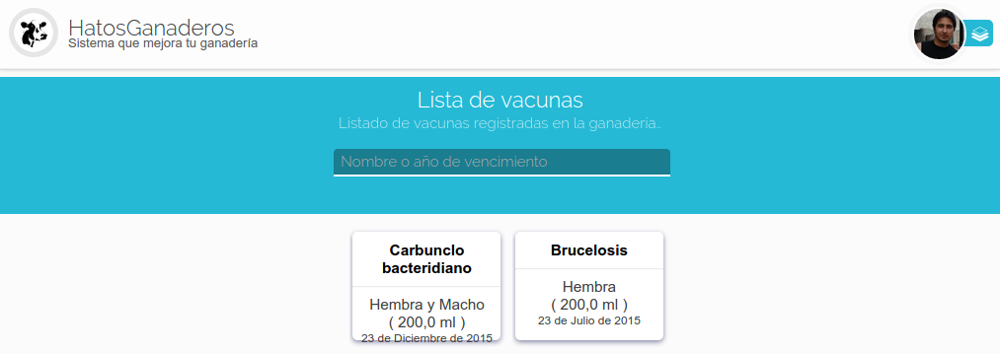
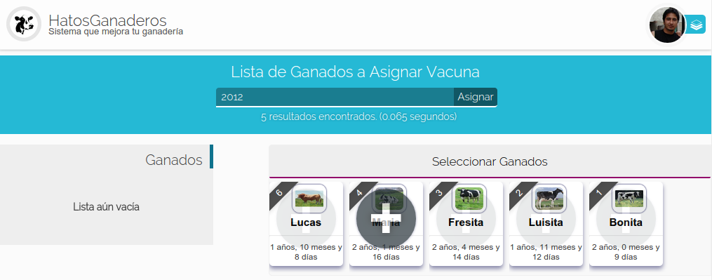

.. HatosGanaderos documentation master file, created by
   sphinx-quickstart on Sun Oct  5 19:31:55 2014.
   You can adapt this file completely to your liking, but it should at least
   contain the root `toctree` directive.

Tutorial 6: Módulo de Sanidad
=============================

HatosGanaderos brinda el módulo de sanidad para registrar los desparasitadores y vacunas para poder administrarles a los ganados de la entidad ganadera.

Agregar Desparasitador
----------------------

El proceso de agregar un desparasitador a la entidad ganadera se lo realizará siguiendo estos sencillos pasos.

Paso 1:
	(Ingresar datos del desparasitador)

	Dirigirse al menu de *HatosGanaderos* :ref:`menu de HatosGanaderos <menu_hatosganaderos>` y en la sección de módulos se encuentra la opción de *Sanidad* debe ser presionada para continuar con el proceso.

	La **figura 2.50.** y **figura 2.51.** muestran unas capturas de pantalla donde se puede observar un formulario que solicita datos para registrar el desparasitador:

		- Nombre de la medicina
		- Fecha de expiración
		- Cantidad de medicina
		- Sexo del ganado a aplicar
		- Edad de aplicación
		- Cantidad de aplicación
		- Ciclo de la medicina (Veces exactas o Repetitivo)
		- Número de aplicaciones
		- Intervalo de tiempo
		- Vía de administración
		- Observaciones

	Luego de ingresar los datos solicitados correctamente se presiona el botón *Grabar* el proceso finaliza exitosamente.

.. figure:: _static/img/agrega_desparasitador1.png
    :width: 100%

    Agregar desparasitador en HatosGanaderos

    Agregar desparasitador en HatosGanaderos

.. _lista_desparasitador:

Listar Desparasitador
---------------------

El proceso de listar desparasitadores se realiza siguiendo estos sencillos pasos.

Paso 1:
	(Listar desparasitadores)

	Dirigirse al menu de *HatosGanaderos* :ref:`menu de HatosGanaderos <menu_hatosganaderos>` y en la sección de módulos se encuentra la opción de *Sanidad* debe ser presionada para continuar con el proceso.

	Se mostrará una pantalla para agregar desparasitador, pero en el menu de la izquierda se presentara la opción de *Listar Desparasitadores* se deberá presionar para continuar con el proceso.

	La **figura 2.52.** muestra una captura de pantalla donde se puede observar el listado de las fichas de cada uno de los desparasitadores registrados en *HatosGanaderos*. Cada ficha contiene:

		- Nombre
		- Ganados a aplicar
		- Cantidad en stock
		- Fecha de expiración

	Y el proceso finaliza de manera correcta.

    Listar desparasitadores en HatosGanaderos

Actualizar Datos del Desparasitador
-----------------------------------

El proceso de actualizar datos del desparasitador registrado en *HatosGanaderos* se debe hacer siguiendo estos sencillos pasos.

Paso 1:
	(Listar y seleccionar el desparasitador)

	Se listan los desparasitadores registrados en *HatosGanaderos* :ref:`¿Cómo listar desparasitadores?' <lista_desparasitador>`.

	La **figura 2.53.** muestra una captura de pantalla donde se puede observar el listado de las fichas de cada uno de los desparasitadores registrados en *HatosGanaderos*. Se hace uso de la barra de búsqueda que provee *HatosGanaderos* que se ubica en la parte superior y funciona bajo los siguientes criterios de búsqueda:

		- Nombre
		- Año de vencimiento

	Echo esto se consigue el desparasitador que buscamos si se coloca el cursor sobre la ficha se mostrarán unas opciones

		- Asignar
		- Actualizar

	Para el proceso que se esta llevando a cabo se presiona la opción *Actualizar*.

    Buscar desparasitador en HatosGanaderos

Paso 2:
	(Actualizar datos)

	La **figura 2.54.** muestra una captura de pantalla donde se puede observar un formulario con datos precargados que son totalmente modificables. 

	Una vez que se haya modificado los datos del desparasitador se presiona el botón *Grabar* y el proceso finaliza exitosamente.

.. figure:: _static/img/actualizar_desparasitador.png
    :width: 100%

    Actualizar desparasitador en HatosGanaderos	

Asignar Desparasitador a Ganados
--------------------------------

El proceso de asignar el desparasitador a los ganados registrados en *HatosGanaderos* se debe hacer siguiendo estos sencillos pasos.

Paso 1:
	(Listar y seleccionar el desparasitador)

	Se listan los desparasitadores registrados en *HatosGanaderos* :ref:`¿Cómo listar desparasitadores?' <lista_desparasitador>`.

	La **figura 2.55.** muestra una captura de pantalla donde se puede observar el listado de las fichas de cada uno de los desparasitadores registrados en *HatosGanaderos*. Se hace uso de la barra de búsqueda que provee *HatosGanaderos* que se ubica en la parte superior y funciona bajo los siguientes criterios de búsqueda:

		- Nombre
		- Año de vencimiento

	Echo esto se consigue el desparasitador que buscamos si se coloca el cursor sobre la ficha se mostrarán unas opciones

		- Asignar
		- Actualizar

	Para el proceso que se esta llevando a cabo se presiona la opción *Asignar*.

    Buscar desparasitador en HatosGanaderos

Paso 2:
	(Buscar los ganados)

	La **figura 2.56.** muestra una captura de pantalla donde se puede observar que se ha realizado el paso anterior y se observa una página donde contiene:

		- Barra de búsqueda.
		- Lista de ganados encontrados.
		- Lista de ganados próximos a asignarles el desparasitador.

.. figure:: _static/img/assign_wormer1.png
    :width: 100%

    Página de asignación del desparasitador en HatosGanaderos	

    La **figura 2.57.** muestra una captura de pantalla donde se puede observar que se hace uso de la barra de búsqueda con el criterio de búsqueda del *Año de nacimiento* y se muestran fichas con los resultados encontrados. Cada ficha contiene:

		- Imagen
		- Nombre
		- Edad

.. figure:: _static/img/assign_wormer2.png
    :width: 100%

    Búsqueda de ganados a asignar desparasitador en HatosGanaderos	

Paso 3:
	(Seleccionar ganados)

	La **figura 2.58.** muestra una captura de pantalla donde se puede observar que al colocar el cursor sobre las fichas se muestra una imagen (+) que significa agregación.

    Asignar ganado parte 1, en HatosGanaderos	

    La **figura 2.59.** muestra una captura de pantalla donde se puede observar que se presiona el símbolo (+) y automáticamente se agrega a la lista de ganados y se quita de la actual lista.

    Asignar ganado parte 2, en HatosGanaderos

    La **figura 2.60.** muestra una captura de pantalla donde se puede observar que si por error se agrego un ganado a la lista de ganados se la puede remover colocando el cursor sobre la etiqueta del ganado y se mostrará una *X* que si se la presiona se retira el ganado y reaparece en la otra lista.

.. figure:: _static/img/assign_wormer5.png
    :width: 100%

    Remover ganado de la lista de ganados en HatosGanaderos

Paso 4:
	(Asignar)

	Para finalizar el proceso de agregación del desparasitador se presiona el botón *Asignar* de la parte superior (junto a la barra de búsqueda) y si la cantidad en stock es suficiente se agregará correctamente.

Agregar Vacuna
--------------

El proceso de agregar una vacuna a la entidad ganadera se lo realizará siguiendo estos sencillos pasos.

Paso 1:
	(Ingresar datos de la vacuna)

	Dirigirse al menu de *HatosGanaderos* :ref:`menu de HatosGanaderos <menu_hatosganaderos>` y en la sección de módulos se encuentra la opción de *Sanidad* debe ser presionada para continuar con el proceso. Se mostrará una página con un menu en la parte izquierda se debe presionar *Agregar vacuna* para continuar con el proceso.

	La **figura 2.61.** y **figura 2.62.** muestran unas capturas de pantalla donde se puede observar un formulario que solicita datos para registrar la vacuna:

		- Nombre de la medicina
		- Fecha de expiración
		- Cantidad de medicina
		- Sexo del ganado a aplicar
		- Edad de aplicación
		- Cantidad de aplicación
		- Ciclo de la medicina (Veces exactas o Repetitivo)
		- Número de aplicaciones
		- Intervalo de tiempo
		- Vía de administración
		- Observaciones

	Luego de ingresar los datos solicitados correctamente se presiona el botón *Grabar* el proceso finaliza exitosamente.

    Agregar vacuna parte 1, en HatosGanaderos

    Agregar vacuna parte 2, en HatosGanaderos

.. _lista_vacuna:

Listar Vacuna
-------------

El proceso de listar vacunas se realiza siguiendo estos sencillos pasos.

Paso 1:
	(Listar vacunas)

	Dirigirse al menu de *HatosGanaderos* :ref:`menu de HatosGanaderos <menu_hatosganaderos>` y en la sección de módulos se encuentra la opción de *Sanidad* debe ser presionada para continuar con el proceso.

	Se mostrará una pantalla para agregar vacuna, pero en el menu de la izquierda se presentara la opción de *Listar Vacunas* se deberá presionar para continuar con el proceso.

	La **figura 2.63.** muestra una captura de pantalla donde se puede observar el listado de las fichas de cada uno de las vacunas registradas en *HatosGanaderos*. Cada ficha contiene:

		- Nombre
		- Ganados a aplicar
		- Cantidad en stock
		- Fecha de expiración

	Y el proceso finaliza de manera correcta.

    Listar vacunas en HatosGanaderos

Actualizar Datos de la Vacuna
-----------------------------

El proceso de actualizar datos de la vacuna registrada en *HatosGanaderos* se debe hacer siguiendo estos sencillos pasos.

Paso 1:
	(Listar y seleccionar la vacuna)

	Se listan las vacunas registradas en *HatosGanaderos* :ref:`¿Cómo listar vacunas?' <lista_vacuna>`.

	La **figura 2.64.** muestra una captura de pantalla donde se puede observar el listado de las fichas de cada uno de las vacunas registradas en *HatosGanaderos*. Se hace uso de la barra de búsqueda que provee *HatosGanaderos* que se ubica en la parte superior y funciona bajo los siguientes criterios de búsqueda:

		- Nombre
		- Año de vencimiento

	Echo esto se consigue la vacuna que buscamos, si se coloca el cursor sobre la ficha se mostrarán unas opciones

		- Asignar
		- Actualizar

	Para el proceso que se esta llevando a cabo se presiona la opción *Actualizar*.

    Buscar vacuna en HatosGanaderos

Paso 2:
	(Actualizar datos)

	La **figura 2.65.** muestra una captura de pantalla donde se puede observar un formulario con datos precargados que son totalmente modificables. 

	Una vez que se haya modificado los datos de la vacuna se presiona el botón *Grabar* y el proceso finaliza exitosamente.

    Actualizar vacuna en HatosGanaderos	

Asignar Vacuna a Ganados
------------------------

El proceso de asignar la vacuna a los ganados registrados en *HatosGanaderos* se debe hacer siguiendo estos sencillos pasos.

Paso 1:
	(Listar y seleccionar la vacuna)

	Se listan las vacunas registradas en *HatosGanaderos* :ref:`¿Cómo listar vacunas?' <lista_vacuna>`.

	La **figura 2.66.** muestra una captura de pantalla donde se puede observar el listado de las fichas de cada uno de las vacunas registradas en *HatosGanaderos*. Se hace uso de la barra de búsqueda que provee *HatosGanaderos* que se ubica en la parte superior y funciona bajo los siguientes criterios de búsqueda:

		- Nombre
		- Año de vencimiento

	Echo esto se consigue la vacuna que buscamos si se coloca el cursor sobre la ficha se mostrarán unas opciones

		- Asignar
		- Actualizar

	Para el proceso que se esta llevando a cabo se presiona la opción *Asignar*.

    Buscar vacuna en HatosGanaderos

Paso 2:
	(Buscar los ganados)

	La **figura 2.67.** muestra una captura de pantalla donde se puede observar que se ha realizado el paso anterior y se observa una página donde contiene:

		- Barra de búsqueda.
		- Lista de ganados encontrados.
		- Lista de ganados próximos a asignarles la vacuna.

    Página de asignación de la vacuna en HatosGanaderos	

    La **figura 2.68.** muestra una captura de pantalla donde se puede observar que se hace uso de la barra de búsqueda con el criterio de búsqueda del *Año de nacimiento* y se muestran fichas con los resultados encontrados. Cada ficha contiene:

		- Imagen
		- Nombre
		- Edad

    Búsqueda de ganados a asignar la vacuna en HatosGanaderos	

Paso 3:
	(Seleccionar ganados)

	La **figura 2.69.** muestra una captura de pantalla donde se puede observar que al colocar el cursor sobre las fichas se muestra una imagen (+) que significa agregación.

    Asignar ganado parte 1, en HatosGanaderos	

    La **figura 2.70.** muestra una captura de pantalla donde se puede observar que se presiona el símbolo (+) y automáticamente se agrega a la lista de ganados y se quita de la actual lista.

    Asignar ganado parte 2, en HatosGanaderos

    La **figura 2.71.** muestra una captura de pantalla donde se puede observar que si por error se agrego un ganado a la lista de ganados se la puede remover colocando el cursor sobre la etiqueta del ganado y se mostrará una *X* que si se la presiona se retira el ganado y reaparece en la otra lista.

    Remover ganado de la lista de ganados en HatosGanaderos

Paso 4:
	(Asignar)

	Para finalizar el proceso de agregación de la vacuna se presiona el botón *Asignar* de la parte superior (junto a la barra de búsqueda) y si la cantidad en stock es suficiente se agregará correctamente.
