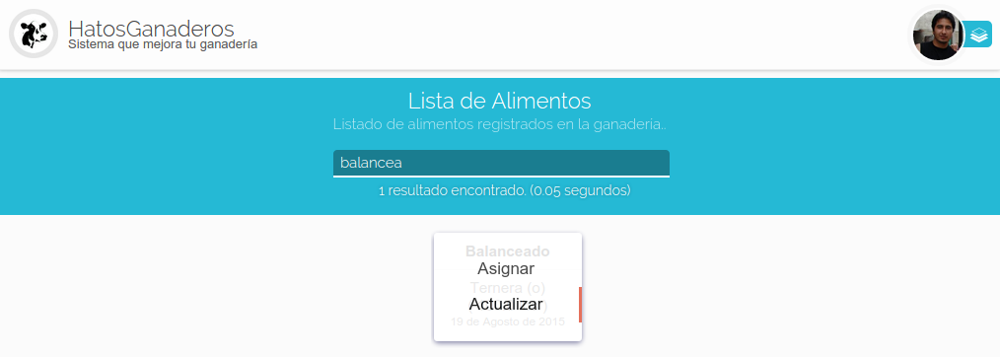

.. HatosGanaderos documentation master file, created by
   sphinx-quickstart on Sun Oct  5 19:31:55 2014.
   You can adapt this file completely to your liking, but it should at least
   contain the root `toctree` directive.

Tutorial 7: Módulo de Alimentación
==================================

HatosGanaderos brinda la posibilidad de registrar el alimento que se administrará a los ganados de la entidad ganadera.

Agregar Alimento
----------------

El proceso de agregar alimento se lo debe realizar siguiendo estos sencillos pasos.

Paso 1:
	(Agregar alimento)

	Dirigirse al :ref:`menu de HatosGanaderos <menu_hatosganaderos>` en la sección de módulos presionar la opción de *Alimentación*.

	La **figura 2.72.** muestra una captura de pantalla donde se puede observar un formulario que nos solicita el ingreso de ciertos datos:

		- Nombre del alimento
		- Fecha de expiración
		- Cantidad del alimento
		- Sexo a aplicar
		- Etapa del ganado a aplicar
		- Cantidad de consumo
		- Intervalo
		- Vía de administración
		- Observaciones

	Luego que se ingresen estos datos de forma correcta se debe presionar el botón *Grabar* y el proceso habrá finalizado correctamente.

.. figure:: _static/img/agrega_alimento.png
    :width: 100%

    Agregar alimentos en HatosGanaderos

Listar Alimento
---------------

El proceso de lsitar se lo realiza siguiendo estos sencillos pasos.

.. _lista_alimento:

Paso 1:
	(Listar alimento)

	Dirigirse al :ref:`menu de HatosGanaderos <menu_hatosganaderos>` en la sección de módulos presionar la opción de *Alimentos* y en la pantalla que se muestra a continuación se debera presionar la opción *Listar Alimentos* del menu de la parte izquierda.

	La **figura 2.73.** muestra una captura de pantalla donde se puede observar el listado de las fichas de cada uno de los alimentos registrados en la entidad ganadera. Cada ficha contiene:

		- Nombre
		- A que ganado va dirigido
		- Cantidad en stock
		- Fecha de caducidad

	El proceso finaliza correctamente.

.. figure:: _static/img/lista_alimento.png
    :width: 100%

    Listar alimentos en HatosGanaderos

Actualizar Alimento
-------------------

El proceso de actualizar el alimento ingresado deberá seguir los siguientes pasos.

.. _buscar_alimento:

Paso 1:
	(Buscar alimento)

	Se debe :ref:`Listar Los alimentos <lista_alimento>` para continuar con el proceso.

	La **figura 2.74.** muestra una captura de pantalla donde se puede observar el listado de las fichas de cada uno de los alimentos registrados en la entidad ganadera. Hay que hacer uso de la barra de búsqueda de la parte superior bajo los siguientes criterios de búsqueda:

		- Nombre
		- Año de vencimiento

    Buscar alimentos en HatosGanaderos

Paso 2:
	(Seleccionar menu actualizar)

	La **figura 2.75.** muestra una captura de pantalla donde se puede observar si se ubica el cursor sobre la ficha del alimento previamente buscado, se mostrará un  menu contextual con las siguientes opciones:

		- Asignar
		- Actualizar

	Se deberá presionar la opción *Actualizar* para continuar con el proceso.

    Menu contextual de actualizar alimento en HatosGanaderos

Paso 3:
	(Actualizar alimento)

	La **figura 2.76.** muestra una captura de pantalla donde se puede observar un formulario que nos presenta datos del registro del alimento en *HatosGanaderos* se tiene la facultad para modificar cualquier atributo.

	Se deberá presionar la opción *Grabar* para finalizar el proceso correctamente.

    Actualizar alimento en HatosGanaderos

Asignar el Alimento al Ganado
-----------------------------

El proceso de asignación de alimentos a los ganados registrados en la entidad ganadera se lo puede realizar siguiendo estos sencillos pasos.

Paso 1:
	(Buscar alimento)

	Se debe :ref:`Buscar el alimento <buscar_alimento>` para continuar con el proceso.

Paso 2:
	(Seleccionar menu asignar)

	La **figura 2.77.** muestra una captura de pantalla donde se puede observar si se ubica el cursor sobre la ficha del alimento previamente buscado, se mostrará un  menu contextual con las siguientes opciones:

		- Asignar
		- Actualizar

	Se deberá presionar la opción *Asignar* para continuar con el proceso.

    Menu contextual de asignar alimento en HatosGanaderos

Paso 3:
	(Buscar los ganados)

	La **figura 2.78.** muestra una captura de pantalla donde se puede observar que se ha realizado el paso anterior y se observa una página donde contiene:

		- Barra de búsqueda.
		- Lista de ganados encontrados.
		- Lista de ganados próximos a asignarles el desparasitador.

    Página de asignación del alimento en HatosGanaderos	

    La **figura 2.79.** muestra una captura de pantalla donde se puede observar que se hace uso de la barra de búsqueda con el criterio de búsqueda del *Año de nacimiento* y se muestran fichas con los resultados encontrados. Cada ficha contiene:

		- Imagen
		- Nombre
		- Edad

.. figure:: _static/img/assign_food2.png
    :width: 100%

    Búsqueda de ganados a asignar alimento en HatosGanaderos	

Paso 3:
	(Seleccionar ganados)

	La **figura 2.80.** muestra una captura de pantalla donde se puede observar que al colocar el cursor sobre las fichas se muestra una imagen (+) que significa agregación.

    Asignar ganado parte 1, en HatosGanaderos	

    La **figura 2.81.** muestra una captura de pantalla donde se puede observar que se presiona el símbolo (+) y automáticamente se agrega a la lista de ganados y se quita de la actual lista.

    Asignar ganado parte 2, en HatosGanaderos

    La **figura 2.82.** muestra una captura de pantalla donde se puede observar que si por error se agrego un ganado a la lista de ganados se la puede remover colocando el cursor sobre la etiqueta del ganado y se mostrará una *X* que si se la presiona se retira el ganado y reaparece en la otra lista.

    Remover ganado de la lista de ganados en HatosGanaderos

Paso 4:
	(Asignar)

	Para finalizar el proceso de agregación del alimento se presiona el botón *Asignar* de la parte superior (junto a la barra de búsqueda) y si la cantidad en stock es suficiente se agregará correctamente.
