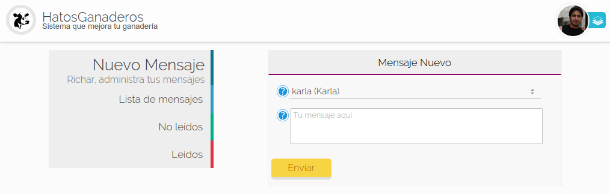
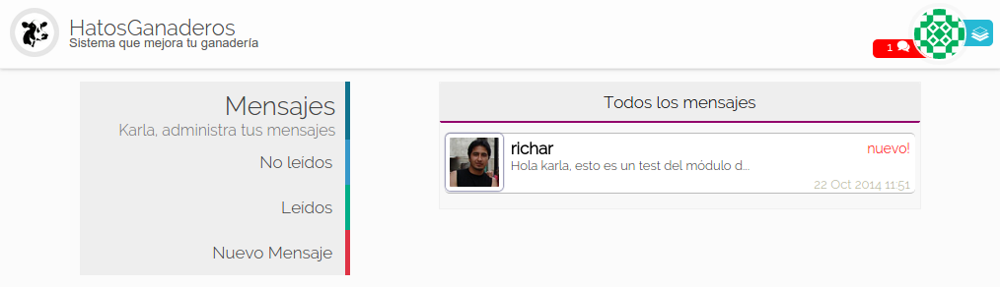
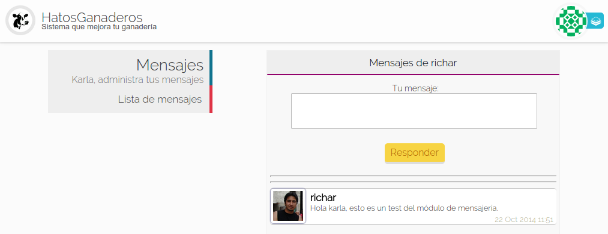
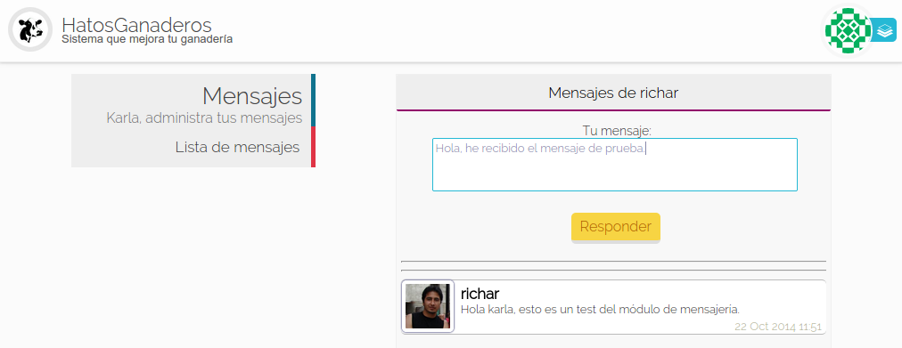

.. HatosGanaderos documentation master file, created by
   sphinx-quickstart on Sun Oct  5 19:31:55 2014.
   You can adapt this file completely to your liking, but it should at least
   contain the root `toctree` directive.

Tutorial 8: Mensajería
======================

HatosGanaderos pone a dispocisión un módulo de mensajería entre técnicos de la entidad ganadera, par facilitar un medio de comunicación integrado en el sistema.

Enviar Mensajes
---------------

El proceso de enviar mensajes se lo puede realizar siguiendo estos sencillos pasos.

Paso 1:
	(Enviar mensaje)

	Dirigirse al :ref:`menu de HatosGanaderos <menu_hatosganaderos>` en la sección de módulos presionar la opción de *Mensajería*.

	Luego presionar le botón del menu izquierdo la opción *Nuevo mensaje*.

	La **figura 2.83.** muestra una captura de pantalla donde se puede observar un formulario que nos solicita el ingreso de ciertos datos:

		- Destinatario
		- Mensaje

	.. note::
		Los destinatarios se cargan automáticamente.

	Luego de ingresar los datos correctos se presiona el botón *Enviar* y el proceso finaliza con éxito.

    Enviar mensajes en HatosGanaderos

.. _detalle_mensaje:

Leer Mensajes
-------------

El proceso de leer mensajes se lo realiza siguiendo los siguientes pasos.

Paso 1:
	(Leer  mensajes)

	Dirigirse al :ref:`menu de HatosGanaderos <menu_hatosganaderos>` en la sección de módulos presionar la opción de *Mensajería*.

	La **figura 2.84.** muestra una captura de pantalla donde se puede observar el listado de mensajes que posee un usuario, cada ficha de mensaje contiene:

		- Imagen del remitente
		- Nombre del remitente
		- Parte del mensaje
		- Fecha
		- Texto que indica que es nuevo mensaje

    Leer mensajes en HatosGanaderos

Paso 2:
	(Detalle de los  mensajes)

	En el paso anterior presionar la ficha del mensaje que deseemos detallar.

	La **figura 2.85.** muestra una captura de pantalla donde se puede observar el mensaje detallado ya cuenta con todo el contenido del mensaje.

    Detalle de los mensajes en HatosGanaderos

Responder Mensajes
------------------

El proceso de responder mensajes se lo realiza siguiendo los siguientes pasos.

Paso 1:
	(Responder mensaje)

	Dirigirse al :ref:`Detalle del mensaje <detalle_mensaje>`.

	La **figura 2.86.** muestra una captura de pantalla donde se puede observar el mensaje detallado y en la parte superior cuenta con una caja de texto que solicita el mensaje de respuesta.

	Luego se presiona el botón *Responder* y el proceso habrá finalizado correctamente.

    Responder mensajes en HatosGanaderos
