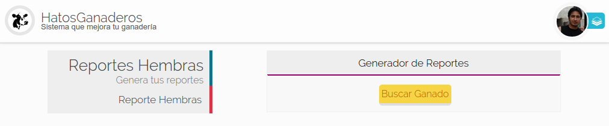
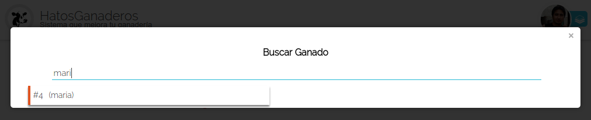
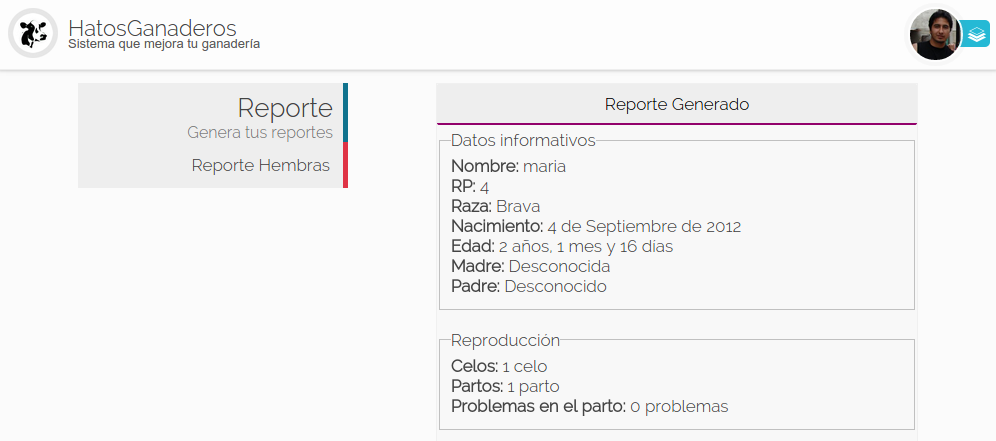
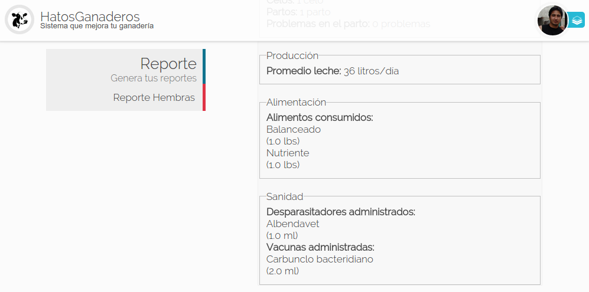

.. HatosGanaderos documentation master file, created by
   sphinx-quickstart on Sun Oct  5 19:31:55 2014.
   You can adapt this file completely to your liking, but it should at least
   contain the root `toctree` directive.

Tutorial 9: Reportes
====================

HatosGanaderos permite generar un reporte qeu contiene datos básicos a cerca de los módulos (Reproducción, producción, alimentación y sanidad)

Generar un Reporte
------------------

Para generar un reporte se debe seguir estos sencillos pasos.

Paso 1:
	(Dirigirse a reportes)

	Dirigirse al :ref:`menu de HatosGanaderos <menu_hatosganaderos>` en la sección de módulos presionar la opción de *Reportes*.

Paso 2:
	(Buscar ganado)

	La **figura 2.87.** muestra una captura de pantalla donde se puede observar una página que contiene un botón *Buscar Ganado* debe ser presionado para continuar

    Reportes en HatosGanaderos

    La **figura 2.88.** muestra una captura de pantalla donde se puede observar que se muestra un ventana emergente que solcita la búsqueda de un ganado bajo los siguientes criterios:

    	- RP
    	- Nombre
    	- Año de nacimiento

    En este caso se busca el ganado *maria*. Se debe presionar la etiqueta del ganado para continuar.

    Buscar ganado para el reporte en HatosGanaderos

Paso 3:
	(Generar reporte)

	La **figura 2.89.** y la **figura2.90** muestran unas capturas de pantalla donde se puede observar que se genero el reporte con datos como:

    	- Datos informativos
    	- Módulo de reproducción
    	- Módulo de producción
    	- Módulo de alimentación
    	- Módulo de sanidad

    Y con esto finaliza exitosamente la generación de un reporte del ganado.

    Reporte del ganado, parte 1, en HatosGanaderos

    Reporte del ganado, parte 2, en HatosGanaderos

